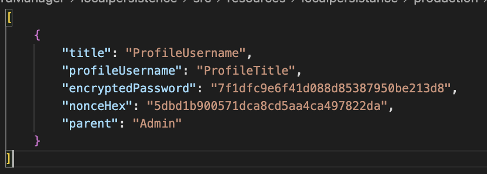

# Release 3

## New features

For this release we have created a REST-API with springboot and implemented the functionality to copy passwords and delete profile. We have also implemented the functionality to encrypt and decrypt passwords. We have also implemented a new architecture, where we have seperated the persistence layer from the core layer. The new architecture is shown in the image below.

<!-- !IMAGE -->

### New architecture

<!-- New architecture. Why and how we implemented it this way-->

<!-- Image or link to orchitecture -->

<!-- Changes to each module vvv -->

### Restserver

<!-- How the restserver works -->

### Encryption

The encryption module contains the encryption algorithm and the hashing algorithm. All UserPasswords are stored as salted hashes so a database leak won´t compromise are users passwords. All profilePasswords are encrypted using a hash of their users passwords as a key, again this means that no stored data can be used to access users passwords. We have not however configured spring to use TLS, so our users passwords are not really safe.

- The encryption utilises an implementation of the TwoFish block cipher algorithm and cipher block chaining. The encryption takes in an arbitrary length byte array and encrypts it using a key, it can then later be decrypted using the same key. The encryption also uses a "nonce" or "number used once" to introduce more confusion into the encryption. This is done so the same plaintext won't be encrypted to the same ciphertext.

- The hash algorithm takes in an arbitrary length byte array and produces the hash for the data, the hashing algorithm is an implementation of the SHA256 algorithm.

### Local Persistence
The new local persistence uses two tables in seperate files, each profile now has a reference to its parent user instead of being nested inside its parent user. This is similar to a foreign key in more traditional database systems like SQL.

- Example of a stored user in our database. The salts are used to generate different hashes, and the password is hashed

- Exaample of a stored profile in our database. The password is encrypted using the parent users password. Nonce is used in the encryption(see encryption)
- 

### UI

The UI has had a few functionalities added, as a few changes in the design, as well as a few bug fixes:

- The password field when creating a new profile now shows how strong the password is, ranking from weak to medium to strong. See image below.

- When adding a new profile, the user can now choose to generate a password for them, or write their own. The generated password will always be rated as strong. See image above.

- Copy and delete icons have been added to the profile list. The copy icon copies the password to the clipboard, and the delete icon deletes the password from the list. See image below.

- When either the title, username or password of a profile is too long, it will be cut off and made vertically scrollable.

- In the previous release, the exit "add profile overlay" button was not visible on all operating systems. This has been fixed, by changing from a X character to a X svg icon. See image below.

- Other minor improvements and bug fixes was also made, such as the window beeing blurred when the "add profile overlay" is visible, and the possibility to mark the text of the profiles.

<!-- Eye images from png to svg? -->

## Code quality

For this release we implemented a new Maven plugin to ensure better code quality:

### Spotbugs

Spotbugs is a static analysis tool that looks for bugs in Java code. It is a plugin for Maven, and can be added to the pom.xml file. We also added Spotbugs to the pipeline, so that it will run every time the code is pushed to the repository. This will ensure that the code is bug free before it is merged to the master branch.

## Pipeline Jobs

For this release we still use the GitLab CI/CD pipeline, but we have added a few new jobs to the pipeline.

List of stages witch jobs, and their order of execution:

- `build`
  - `validate` - validates the project is correct and all necessary information is available. Merge blocked if this fails.
  - `compile` - compiles the source code of the project. Merge blocked if this fails.

- `test`
  - `test` - runs all the tests in the project. Merge blocked if this fails.

- `coverage`
  - `test-coverage-minimum` - runs all the tests in the project and checks if the test coverage is above 60%. Merge blocked if this fails.
  - `test-coverage-80` - runs all the tests in the project and checks if the test coverage is above 80%. Merge warning if this fails.

- `quality`
  - `checkstyle` - runs checkstyle on the project. Merge warning if this fails.
  
- `bugs`
  - `spotbugs` - runs spotbugs on the project. Merge warning if this fails.

## Workflow

Like we did when working with release 2, we used the GitLab issue tracker to keep track of our issues and milestones. We still used the GitLab CI/CD pipeline to run our tests and check our code quality, but we made some changes in the pipeline jobs (listed above). We used the GitLab merge request feature to ensure that we do not push directly to the master branch.

For this release we had atleast two meetings a week, where we discuss our progress and what we need to do to finish the project. Those meetings also consists of us coding together for several hours.
